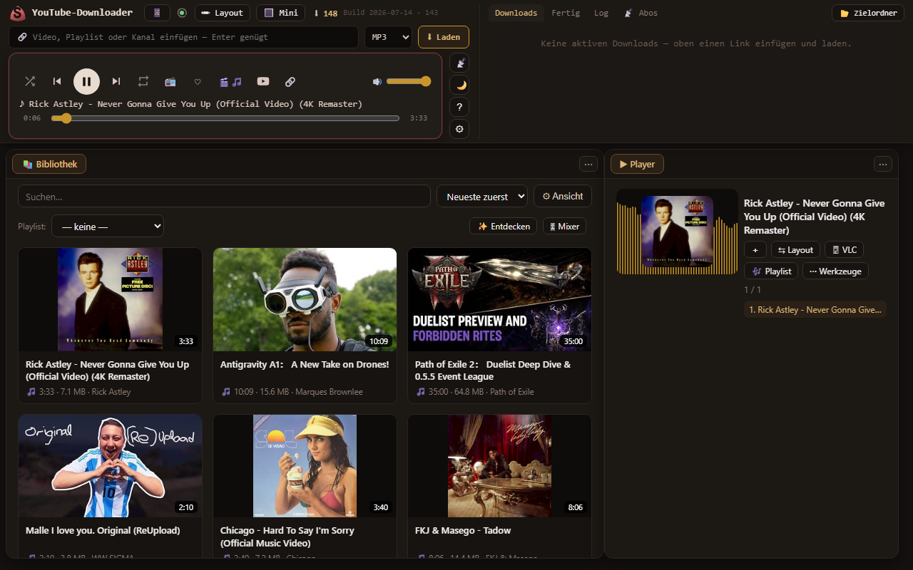

# SyncYouTube

Lokaler YouTube-Downloader **und** vollwertiger Musik-/Video-Player mit Bibliothek —
eine einzige Web-Oberfläche auf `http://127.0.0.1:8776`, komplett offline auf dem eigenen PC
(einzige Außenverbindungen: YouTube selbst, MusicBrainz fürs Tagging, die SponsorBlock-Datenbank
und — nur auf Wunsch — der Update-Check gegen dieses GitHub-Repo).



## Features

**Downloads**
- Warteschlange ohne Limit, Qualität je Eintrag (Beste/4K/1440p/1080p/720p/MP3), Playlist-Auflösung
- Auto-Retry mit Backoff + Resume (setzt nach Abbruch/Neustart genau dort fort), Netzwerk-Timeout-Schutz
- Premium/altersbeschränkt über Browser-Cookies (Firefox/Chrome/Edge)
- Dubletten-Erkennung über die Video-ID, „Schon geladen“-Datenbank
- SponsorBlock (Werbung/Intros aus der Datei schneiden), Metadaten + Thumbnail als Cover
- Kanal-/Playlist-**Abos** (holt nur Neues), Ausschnitt/Clip (von–bis, ohne Längenlimit)
- Ganze **Playlists und Mixe** laden (bei `watch?v=…&list=…` fragt die App nach; Mixe bis 50 Titel)
- Gestufte Geo-Umgehung: Header-Trick → eigene Proxys → Gratis-Proxys → VPN (Nord/Windscribe/WireGuard)
- Downloads-Ordner heilt sich selbst: von Hand verschobene Dateien wandern automatisch
  zurück nach `MP3` / `4K+` / `Video` (Unklares nach `Sonstiges`); Metadaten (Titel/Künstler)
  werden bei Alt-Dateien automatisch nachgetragen
- **Ordner-Import**: fremde Musik-/Videodateien im Downloads-Ordner werden automatisch
  in die Bibliothek aufgenommen (nicht nur selbst geladene)

**Player**
- Steuerleiste **auf dem Video/Cover** (YouTube-Stil): Spulen, Transport, Untertitel, Clip,
  Tempo, Lautstärke, YouTube-Knopf, Vollbild — blendet bei Maus-Ruhe aus
- **Zufall und Wiederholen als getrennte Schalter** (Spotify-Muster, eigene SVG-Icons);
  Einzeltitel zu Ende → automatisch der nächste Bibliotheks-Titel (Autoplay)
- 8 Visualizer (Balken/Spiegel/Welle/Oszilloskop/Radial/Matrix/Spektrogramm), Canvas-Cover-Hintergrund
- Übergänge: Gapless / Crossfade (0–12 s) / Automix · Equalizer + Lautstärke-Angleich
- Untertitel → **Karaoke** (Original-Sprache, japanisch automatisch als **Romaji**) → Transkript,
  fehlende Untertitel lädt die App still von YouTube nach
- YouTube-Kapitel als Sprungmarken, Sleep-Timer, 📻 Endlos-Radio
- Rechtsklick-Menü mit Windows-Ausklapp-Untermenüs, Klick auf die Fläche = Pause, Media-Tasten

**Bibliothek**
- Kacheln / **Alben** (Auto-Tagging via MusicBrainz) / Liste, konfigurierbare Spalten
- Titel per Maus **in die Player-Playlist ziehen**; Playlist als eigenes, andockbares Fenster
- Playlists (öffnen, umsortieren, .m3u-Import/-Export, Geräte-Sync kopieren/spiegeln)
- Smart-Playlists (Regeln), Meistgespielt/Zuletzt, Dublettenfinder, Batch-Tag-Editor
- Rechtsklick-Kontextmenüs wie im Explorer, Mehrfachauswahl (Strg/Shift), Papierkorb statt Löschen

**Oberfläche**
- Fenster-System mit Tabs: Tab herausziehen (füllt die freie Lücke), Tab auf ein anderes
  Fenster ziehen = dort andocken, transluzente Drag-Vorschau
- ✏-Layout-Modus: verschieben mit Platzhalter-Vorschau, 8 Größen-Griffe, Fenster
  überlappen sich nie; Layouts speichern/benennen, ↩ Verlust-Schutz, 5 Looks, Mini-Player
- Sticky Command-Bar: Link einfügen → Download, Live-Warteschlange (Klick = Pause, ✖ = abbrechen),
  großer Mini-Player mit Spulleiste, Zwischenablage-/Einfügen-Erkennung
- Mausrad-Kippen = Ansicht-Verlauf zurück/vor, Link ins Fenster ziehen = Download, ?-Legende

**Extras**
- 📱 Handy-Fernsteuerung im Heim-WLAN (opt-in, Zugangscode, Gerät wählbar wie bei Spotify Connect)
- Browser-Erweiterung für Firefox/Chrome/Edge (`System/browser-addon/`, ein Code; die signierte
  Firefox-`.xpi` liegt beim Release und ist über das Tray-Menü/die Einstellungen installierbar —
  ab v1.0.4 aktualisiert sie sich in Firefox selbst über die Releases dieses Repos)
- **Selbst-Update** (opt-in, Standard aus): die exe prüft täglich dieses Repo, lädt verifiziert
  (SHA256-Abgleich gegen das `.sha256`-Asset) und tauscht sich ohne Adminrechte selbst

## Voraussetzungen / Start (aus dem Quellcode)

1. **Python 3.12+** und die Pakete:
   ```
   pip install "yt-dlp[default]" pykakasi pystray pillow
   ```
2. **`System/bin/`-Ordner** mit `ffmpeg.exe`, `ffprobe.exe` und `deno.exe`
   (Deno ist Pflicht — ohne JS-Runtime liefert YouTube seit 2026 „No video formats found“).
   Die Binärdateien sind nicht im Repo; von den offiziellen Seiten laden (ffmpeg.org, deno.com).
3. Start: `python System/youtube_app.py` — oder unter Windows die `SyncYouTube.bat`
   (Pfad zur eigenen Python-Umgebung anpassen). Oberfläche: `http://127.0.0.1:8776`.

Tests: `python System/tests/test_youtube.py` (läuft ohne Zusatzpakete, kein Netz).

## Aufbau

| Datei | Zweck |
|---|---|
| `System/youtube_app.py` | Server, Warteschlange, Download-Logik, Bibliothek, Playlists, Tray |
| `System/oberflaeche.py` | die komplette PC-Oberfläche (eine Datei, wird heiß nachgeladen) |
| `System/handy.py` | Touch-Oberfläche der Fernsteuerung (`/m`) |
| `System/geo.py` / `System/vpn.py` | gestufte Geo-Umgehung / NordVPN-Steuerung |
| `System/update.py` | Selbst-Update der exe (Repo-Pin, SHA256-Verifikation, Rollback) |
| `System/browser-addon/` | universelle Browser-Erweiterung + Build-/Signier-Skripte |
| `System/_ARCHITEKTUR.md` | Architektur & Fahrplan (historisch, 09.07.; aktuelle Karte: `System/MODULE.md`) |
| `System/docs/NAECHSTER_PROMPT.md` | Übergabe an die nächste Session (aktuell, 05.08.) |

Konfiguration und alle Nutzerdaten (`config.json`, `geladen_log.json`, `playlists.json`,
`warteschlange.json`, `abos.json`, `Downloads/`) entstehen zur Laufzeit und bleiben lokal —
sie gehören bewusst **nicht** ins Repo.

## Download (Windows, ohne Python)

Unter **Releases** liegt die all-inclusive `SyncYouTube.exe` (ffmpeg/ffprobe/deno eingebaut):
herunterladen, starten, fertig — sie ist seit v.1.2.4 signiert (siehe unten). Daneben das
`.sha256`-Asset zum Prüfen und die signierte
Firefox-Erweiterung (+ `updates.json`, ihr Update-Kanal: einmal installiert, hält Firefox
sie ab v1.0.4 selbst aktuell). Updates holt die exe auf Wunsch selbst (Einstellungen →
„Selbst-Update“, oder Tray → „Nach Updates suchen…“).

### Signatur (seit v.1.2.4)

Die `SyncYouTube.exe` ist **signiert**: Herausgeber ist die **JBK-Holding GmbH**
(EV-Code-Signing-Zertifikat von Sectigo, mit RFC-3161-Zeitstempel). Prüfen lässt sich
das ohne Zusatzprogramm: Rechtsklick auf die Datei, *Eigenschaften*, Reiter *Digitale
Signaturen*.

Warum das wichtig ist: Bis v.1.2.3 war die Datei unsigniert. Jeder PyInstaller-Build ist
ein frisch gehashtes Unikat ohne Herausgeber, und Windows Defender hat solche Dateien nach
einem Update seiner Erkennungsmuster wiederholt in Quarantäne gesetzt — bei einem Nutzer
reproduzierbar „nach ein paar Tagen". Auch **Smart App Control** (Windows 11) blockierte
sie ohne „Trotzdem ausführen"-Knopf. Mit EV-Signatur gibt es SmartScreen-Reputation ohne
Anlaufzeit.

Wer noch eine ältere, unsignierte Fassung hat: einfach die aktuelle aus den
[Releases](../../releases/latest) laden.

### Der Quellstart-Weg (ohne exe)

Er bleibt als Alternative, etwa in stark abgeriegelten Umgebungen:

1. `SyncYouTube-Quellstart.zip` aus den Releases laden und entpacken.
2. `SyncYouTube-Quellstart.bat` doppelklicken — gestartet wird der **offizielle,
   von der Python Software Foundation signierte** Python-Interpreter; unsere
   `.py`-Dateien sind für Smart App Control Daten, keine Programme.

Alternativ mit eigenem Python (von [python.org](https://python.org), signiert):
Repo laden, `pip install yt-dlp pystray pillow mutagen pykakasi keyring qrcode python-vlc`,
dann `pythonw System\youtube_app.py`.

## Lizenz

**GPL-3.0-or-later** (siehe [LICENSE](LICENSE)). Diese Lizenz gilt für den eigenen Code
in diesem Repo. Die ausgelieferte `SyncYouTube.exe` v1.2.4 packt zusätzlich fremde
Bibliotheken und drei fertige Programme ein; die Liste unten ist aus der Bauliste des
Builds (`System/build/SyncYouTube/Analysis-00.toc`) und den Paket-Angaben der
Python-Umgebung gemessen, nicht aus dem Gedächtnis geschrieben.

**Es gibt keinen Lizenz-Konflikt.** Jeder Bestandteil ist mit GPL-3.0-or-later
verträglich: GPL-2.0-**or-later** darf auf Version 3 gehoben werden, Apache-2.0 ist
in eine Richtung mit GPLv3 verträglich, und MPL-2.0 trägt dafür eine eigene Klausel.

### Bestandteile mit Copyleft (hier entstehen Pflichten)

| Bestandteil | Fassung | Lizenz |
|---|---|---|
| [FFmpeg](https://ffmpeg.org) (`ffmpeg.exe` + `ffprobe.exe`) | `N-125505-gc57660fb18-20260708` | **GPLv3** (gebaut mit `--enable-gpl --enable-version3`, ohne `--enable-nonfree`) |
| [pykakasi](https://codeberg.org/miurahr/pykakasi) | 2.3.0 | GPL-3.0-or-later |
| [mutagen](https://github.com/quodlibet/mutagen) | 1.48.1 | GPL-2.0-or-later |
| [pystray](https://github.com/moses-palmer/pystray) | 0.19.5 | LGPLv3 |
| [python-vlc](https://github.com/oaubert/python-vlc) | 3.0.21203 | LGPL-2.1-or-later |
| [PyInstaller](https://pyinstaller.org) (Startprogramm der exe) | 6.21.0 | GPL-2.0-or-later mit Bootloader-Ausnahme |

Beim FFmpeg-Programm ist die Angabe genauer als früher: Es ist ausdrücklich ein
**GPLv3**-Build, nicht nur „GPL", weil `--enable-version3` gesetzt ist. Weitergeben darf
man ihn, denn `--enable-nonfree` fehlt.

### Bestandteile mit freizügiger Lizenz

Diese Lizenzen verlangen keine Gegenleistung, wohl aber, dass **Copyright-Vermerk und
Lizenztext mit ausgeliefert werden** — Namensnennung allein genügt nicht. Ehrlich gesagt:
in der heutigen `SyncYouTube.exe` liegen nur zehn dieser Lizenztexte bei, für die übrigen
fehlen sie. Das ist ein offener Punkt und kein erledigter. Bis er behoben ist, stehen
Name, Fassung und Lizenz wenigstens hier, und jede Fassung ist über die unten genannten
Quellen samt ihrem Lizenztext auffindbar. Nach Lizenz gebündelt:

- **Unlicense:** yt-dlp 2026.8.19 · yt-dlp-ejs 0.8.0 (dieses zusätzlich MIT und ISC).
- **MIT:** [Deno](https://deno.com) 2.9.2 (`deno.exe`) · altgraph 0.17.5 · brotli 1.2.0 ·
  cffi 2.0.0 · charset-normalizer 3.4.7 · clr_loader 0.3.1 · curl_cffi 0.15.0 ·
  Deprecated 1.3.1 · jaconv 0.5.0 · jaraco.classes 3.4.0 · jaraco.context 6.1.2 ·
  jaraco.functools 4.5.0 · keyring 25.7.0 · more-itertools 11.1.0 · pefile 2024.8.26 ·
  pythonnet 3.1.0 · PyYAML 6.0.3 · setuptools 82.0.1 · six 1.17.0 · urllib3 2.7.0.
- **MIT-CMU:** pillow 12.2.0 (die Angabe „MIT-HPND" hier war falsch).
- **BSD (2- oder 3-Klausel, 0BSD):** chardet 7.6.0 · idna 3.18 · psutil 7.2.2 ·
  pycparser 3.0 · pyreadline3 3.5.6 · pywin32-ctypes 0.2.3 · qrcode 8.2 ·
  websockets 16.0 · wrapt 2.2.2.
- **Doppelt lizenziert:** cryptography 49.0.0 (Apache-2.0 oder BSD-3-Clause) ·
  packaging 26.2 (Apache-2.0 oder BSD-2-Clause) · simplejson 4.1.1 (MIT oder AFL-2.1).
- **Apache-2.0:** requests 2.34.2.
- **MPL-2.0:** certifi 2026.6.17 (das Wurzelzertifikat-Bündel).
- **Python-Lizenz:** defusedxml 0.7.1 (PSF) · typing_extensions 4.16.0 (PSF-2.0).
- **Gemischt, alles freizügig:** numpy 2.5.1 (BSD-3-Clause, 0BSD, MIT, Zlib, CC0-1.0) ·
  pycryptodomex 3.23.0 (BSD und Public Domain).
- **Von setuptools mitgeliefert** (sie liegen unter `setuptools/_vendor/` und wandern
  darum mit in die exe, ohne eigenständig installiert zu sein): importlib_metadata 8.7.1
  (Apache-2.0) · backports.tarfile 1.2.0 · tomli 2.4.0 · wheel 0.46.3 · zipp 3.23.0
  (die vier zuletzt genannten MIT).

### Wo der Quellcode liegt

GPL und LGPL verlangen, dass der Quellcode zu dem verfügbar ist, was ausgeliefert wird.

1. **Eigener Code:** vollständig in diesem Repo, dieselbe Fassung wie in der exe.
2. **Python-Bibliotheken:** auf [PyPI](https://pypi.org) unter genau den oben genannten
   Fassungen, soweit dort ein Quell-Archiv liegt. Eine Ausnahme ist geprüft und
   dokumentiert: **pystray 0.19.5** wurde auf PyPI nur als Wheel veröffentlicht, das
   letzte Quell-Archiv trägt 0.19.4. Der Quellcode zu 0.19.5 liegt im Projekt selbst,
   [moses-palmer/pystray](https://github.com/moses-palmer/pystray), Marke `v0.19.5`.
   Das zählt, weil pystray unter LGPLv3 steht und damit tatsächlich eine Pflicht auslöst.
3. **FFmpeg:** Der beigelegte Build stammt nicht von uns. Seine Konfigurations-Zeile
   (`--prefix=/ffbuild/prefix`, crosstool-NG-Werkzeugkette, `--extra-version=20260708`)
   ist die der Windows-Sammelbuilds von
   [BtbN/FFmpeg-Builds](https://github.com/BtbN/FFmpeg-Builds) in der Spielart
   `win64-gpl`; diese Builds sind von der offiziellen
   [FFmpeg-Downloadseite](https://ffmpeg.org/download.html) verlinkt. Das Bau-Rezept
   steht dort in `scripts.d/`, `variants/` und `patches/`. Der FFmpeg-Quellcode selbst
   ist durch die Kennung des Builds eindeutig bestimmt: Git-Stand **`c57660fb18`** im
   [FFmpeg-Repo](https://github.com/FFmpeg/FFmpeg). Ehrlicher Vorbehalt: die genaue
   Herunterlade-Adresse dieser Datei ist nicht protokolliert, und derselbe Bauplan wird
   auch vom Ableger [yt-dlp/FFmpeg-Builds](https://github.com/yt-dlp/FFmpeg-Builds)
   benutzt. Beim nächsten Austausch der Datei gehört die Adresse der geladenen
   Veröffentlichung hier hinein.
4. **Deno:** Quellcode im [Deno-Repo](https://github.com/denoland/deno), Fassung 2.9.2.

Wer die genannten Fassungen nicht selbst holen möchte, bekommt sie auf Nachfrage.
